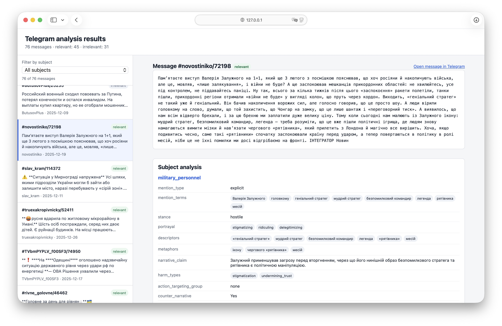

# Process Telegram Messages with LLM

This project extracts structured observations from Telegram messages to support
future analysis of how social groups are represented in social media.

It covers the middle stage of a broader workflow:

```text
collect Telegram messages
  -> extract structured observations
  -> aggregate by group, channel, and time
  -> build an analytical social portrait
```

The project provides scripts for preparing a reproducible test dataset,
filtering clearly irrelevant messages, processing messages with an LLM,
reviewing and annotating the extracted data in local web interfaces, and
summarizing token usage.

The local viewer displays the original Telegram messages alongside the
structured LLM output and supports filtering by extracted subject.



## Usage

Run commands from the project root. Python and the required packages are
expected to be available in the active environment. LLM processing also
requires the `OPENAI_API_KEY` environment variable.

<details>
<summary><code>scripts/collect_test_dataset.py</code> — create a reproducible sample</summary>

Create a random sample of 100 messages from a historical CSV file:

```bash
python scripts/collect_test_dataset.py \
  --historic_file=/path/to/source.csv \
  --n=100 \
  --output=data/test/dataset.csv
```

The script preserves all CSV columns and uses a fixed random seed, so repeated
runs against the same source produce the same sample.

</details>

<details>
<summary><code>scripts/filter_irrelevant_messages.py</code> — remove clearly irrelevant messages</summary>

Filter the test dataset and optionally save rejected rows with their rejection
reasons:

```bash
python scripts/filter_irrelevant_messages.py \
  --input_file=data/test/dataset.csv \
  --output_file=data/test/relevant.csv \
  --rejected_file=data/test/rejected.csv
```

The filter removes messages such as short or empty posts, operational air-alert
updates, clear advertisements, and utility outage schedules.

</details>

<details>
<summary><code>scripts/process_messages.py</code> — extract structured observations</summary>

Process messages asynchronously through the OpenAI API:

```bash
python scripts/process_messages.py process \
  --input_file=data/test/relevant.csv \
  --output_file=data/test/results.jsonl \
  --prompt_folder=prompts/v3
```

For a full run, submit messages through the Batch API and save the batch ID
printed by the first command:

```bash
python scripts/process_messages.py submit_batch \
  --input_file=data/test/relevant.csv \
  --prompt_folder=prompts/v3
```

After the batch finishes, collect its results:

```bash
python scripts/process_messages.py collect_batch \
  --batch_id=BATCH_ID \
  --output_file=data/test/results.jsonl \
  --prompt_folder=prompts/v3
```

Each JSONL record contains the source-qualified message ID, structured output,
prompt version, model and response metadata, and token usage.

</details>

<details>
<summary><code>scripts/visualize_results.py</code> — inspect results in a browser</summary>

Start the local web viewer:

```bash
python scripts/visualize_results.py \
  --input_file=data/test/relevant.csv \
  --results_file=data/test/results.jsonl
```

Open the URL printed by the script. The viewer joins source messages and LLM
results by their source-qualified message IDs and shows relevant, irrelevant,
failed, and missing results.

</details>

<details>
<summary><code>scripts/annotate_results.py</code> — annotate results</summary>

Start the separate feedback interface to add line-based notes and manually
validate results:

```bash
python scripts/annotate_results.py \
  --input_file=data/test/relevant.csv \
  --results_file=data/test/results.jsonl \
  --feedback_file=prompts/v3/feedback.md
```

The feedback file's directory must contain `shared-prompt.md` and
`output_schema.py`. If the Markdown file does not exist, the annotator creates
it with every source message. The sidebar separates messages into `TBD` and
`Done` lists, and the subject filter applies to both lists.

Hotkeys: `↑`/`↓` move between messages, and `v` toggles validation. They are
disabled while an input field has focus.

Each non-empty textarea line is stored as one Markdown bullet. `Validated` is
stored as `status: [x]`, while an unchecked record uses `status: [ ]`. The
Markdown file is the only persistent review state, so browser reloads pick up
external file changes.

</details>

<details>
<summary><code>scripts/count_token_usage.py</code> — summarize usage and cost</summary>

Print the token usage summary:

```bash
python scripts/count_token_usage.py \
  --input_file=data/test/results.jsonl
```

Save the summary to a file:

```bash
python scripts/count_token_usage.py \
  --input_file=data/test/results.jsonl \
  --output_file=/tmp/token_usage.txt
```

Estimate cost by passing per-million-token prices for regular input, cached
input, and output tokens, in that order:

```bash
python scripts/count_token_usage.py \
  --input_file=data/test/results.jsonl \
  --token_prices='[0.2,0.02,1.2]'
```
